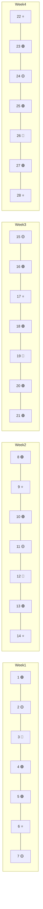

# Ai

```mermaid
graph LR

subgraph Week1
A1[1 🟢] --- A2[2 🟡] --- A3[3 🔴] --- A4[4 🟢] --- A5[5 🟢] --- A6[6 ⭐] --- A7[7 🟡]
end

subgraph Week2
B1[8 🟢] --- B2[9 ⭐] --- B3[10 🟢] --- B4[11 🟡] --- B5[12 🔴] --- B6[13 🟢] --- B7[14 ⭐]
end

subgraph Week3
C1[15 🟡] --- C2[16 🟢] --- C3[17 ⭐] --- C4[18 🟢] --- C5[19 🔴] --- C6[20 🟢] --- C7[21 🟢]
end

subgraph Week4
D1[22 ⭐] --- D2[23 🟢] --- D3[24 🟡] --- D4[25 🟢] --- D5[26 🔴] --- D6[27 🟢] --- D7[28 ⭐]
end
```

```mermaid
graph TD

subgraph Week_1
D1[1] --- D2[2] --- D3[3] --- D4[4] --- D5[5] --- D6[6] --- D7[7]
end

subgraph Week_2
D8[8] --- D9[9] --- D10[10] --- D11[11] --- D12[12] --- D13[13] --- D14[14]
end

subgraph Week_3
D15[15] --- D16[16] --- D17[17] --- D18[18] --- D19[19] --- D20[20] --- D21[21]
end

subgraph Week_4
D22[22] --- D23[23] --- D24[24] --- D25[25] --- D26[26] --- D27[27] --- D28[28]
end

%% Performance colors
style D1 fill:#2ecc71
style D2 fill:#f1c40f
style D3 fill:#e74c3c
style D4 fill:#2ecc71
style D5 fill:#27ae60
style D6 fill:#16a085
style D7 fill:#f39c12

style D8 fill:#2ecc71
style D9 fill:#16a085
style D10 fill:#27ae60
style D11 fill:#f1c40f
style D12 fill:#e74c3c
style D13 fill:#2ecc71
style D14 fill:#16a085

style D15 fill:#f1c40f
style D16 fill:#2ecc71
style D17 fill:#16a085
style D18 fill:#27ae60
style D19 fill:#e74c3c
style D20 fill:#2ecc71
style D21 fill:#2ecc71

style D22 fill:#16a085
style D23 fill:#27ae60
style D24 fill:#f1c40f
style D25 fill:#2ecc71
style D26 fill:#e74c3c
style D27 fill:#2ecc71
style D28 fill:#16a085
```
