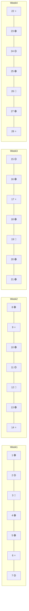

# Ai

```mermaid
graph LR

subgraph Week1
A1[1 🟢] --- A2[2 🟡] --- A3[3 🔴] --- A4[4 🟢] --- A5[5 🟢] --- A6[6 ⭐] --- A7[7 🟡]
end

subgraph Week2
B1[8 🟢] --- B2[9 ⭐] --- B3[10 🟢] --- B4[11 🟡] --- B5[12 🔴] --- B6[13 🟢] --- B7[14 ⭐]
end

subgraph Week3
C1[15 🟡] --- C2[16 🟢] --- C3[17 ⭐] --- C4[18 🟢] --- C5[19 🔴] --- C6[20 🟢] --- C7[21 🟢]
end

subgraph Week4
D1[22 ⭐] --- D2[23 🟢] --- D3[24 🟡] --- D4[25 🟢] --- D5[26 🔴] --- D6[27 🟢] --- D7[28 ⭐]
end
```
