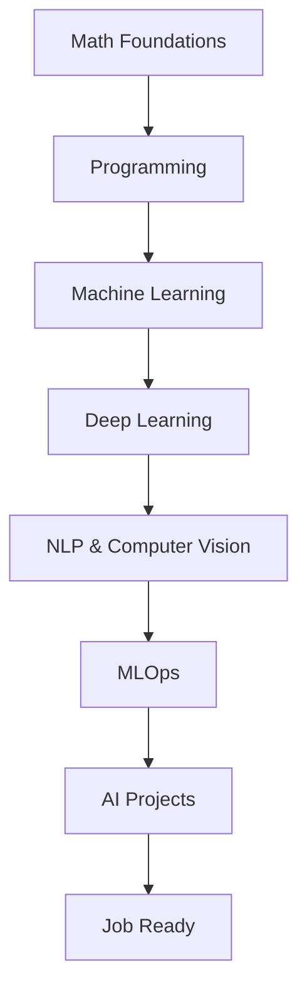
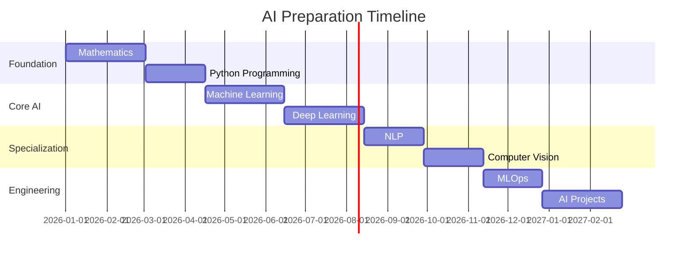

# AI Learning Roadmap

# Roadmap Timeline

# Mathematics for AI

* Topics

* Linear Algebra
* Probability
* Statistics
* Calculus
* Optimization

* Key Concepts

* Vectors & matrices
* Eigenvalues & eigenvectors
* Probability distributions
* Gradient descent
* Partial derivatives

 # Programming for AI

- Language focus:

```Python
Python
```

# Libraries:

* NumPy
* Pandas
* Matplotlib
* Scikit-learn

# Skills to master:

* data preprocessing
* vectorized computation
* debugging
* dataset manipulation
  
# Machine Learning
Supervised Learning
Algorithms
- Linear Regression
- Logistic Regression
- Decision Trees
- Random Forest
- Gradient Boosting
- Support Vector Machines

Unsupervised Learning
- K-Means
- Hierarchical clustering
- PCA
- Dimensionality reduction
